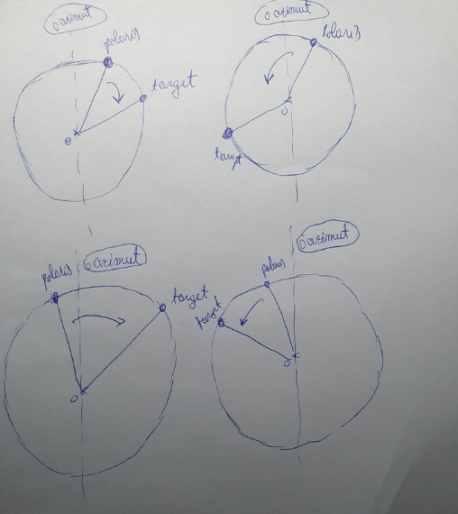

# Auto-Orienting Telescope #
This project represents the Arduino Code for a system that automatically alignes
the position of a telescope so that a given star is reached in it's FOV.

It also contains the client code that a user would use to connect to the system
using his laptop and provide to Arduino the coordinates of the followed object
and the local date-time coordinates.

## Arduino Code ##
The Arduino program can be divided in 3 big steps:
- receive data from the client using bluetooth
- compute the horizon coordinates (azimuth and altitude) for the given celestial
object
- move the telescope so that the target object is included in it's FOV

For receiving data from the client, we are using the `SoftwareSerial` Arduino
library, which allows for easy communication with an HC06 bluetooth module.
The data that needs to be received from the outside of the system:
- local date and time (at minutes precision)
- local longitude and latitude (for astronomical calculations)
- the celestial coordinates (right ascension and declination) of the object we
want to track

Computing the horizon coordinates from the given celestial coordinates is a
straightforward, but long, algorithmic process, that involves taking into
account local date-time and geographical position.
The first step is computing the local sideral time (LST), starting from the current
UTC time:
    UTC + JulianDate(`julian()`) -> GST (`utctogst()`) -> LST (`gsttolst`)
The second step involves the actual azimuth-altitude computation (the `azalt()` function),
using celestial body coordinates, geographical coordinates and the local sideral time
computed before.

The third step is the most challenging one, since it involves precision requirements.
A4988 drivers were required to reduce stepper motors step from 1.8 degrees to
0.112 degrees.
In order to know how much and in which direction we need to rotate the telescope,
we asume that it is oriented to Polaris (astronomical north) at the beginning
of each movement. Therefore, we compute the deviations as:
`targetAzimuth - polarisAzimuth` and `targetAltitude - polarisAltitude`
For altitude, the rotation of the telescops is pretty straightforward, just
increase or deacrese the angle between the telescope and the horizontal plain.
Because we want the angle we move the telescope in the horizontal plane to be as
small as possible (in order to reduce errors accumulation), we don't always rotate
the telescope in the same direction. Instead, we compare the value of the target
azimuth with the azimuth of Polaris (our reference) and with 180 degrees,
This way, we split the rotation in 4 possible scenarios, as in the picture below:

### Error correction ###
Steppers can cause errors: loosing steps, inconsistent step size etc.
In order to reduce those, we provide an active correction mechanism, using
an MPU6050 sensor. Every time after 50 steps, we check how much the telescope
has rotated from it's initial position, using values read from the gyro, and
we adjust the remained number of steps accordingly.
From the `MPU_6050_light` library used for reading gyro data, we know that
we should update the value read from the gyro as often as possible, so that the
time interval between two succesive updates `dt` will be as small as possible
and the relation below is valid:
`angle[t] = angle[t-1] + gyro * dt`
Therefore, we update the gyro value twice at every rotation steps, even though
we only use it once at 50 steps.

## Client Code ##
The client is represented by a simple python application that runs in a terminal.
Using python's `simple_term_menu` module, we create a navigable menu that allows
the user to select from a list of celestial bodies. After the user selects one
object, the celestial coordinates are sent to arduino via bluetooth, together
with the location and current UTC time (found behind the scenes using the `datetime`
and `geocoder` modules).
Of course, the computer that runs the application should support bluetooth in order
to connect with the orientation system.
